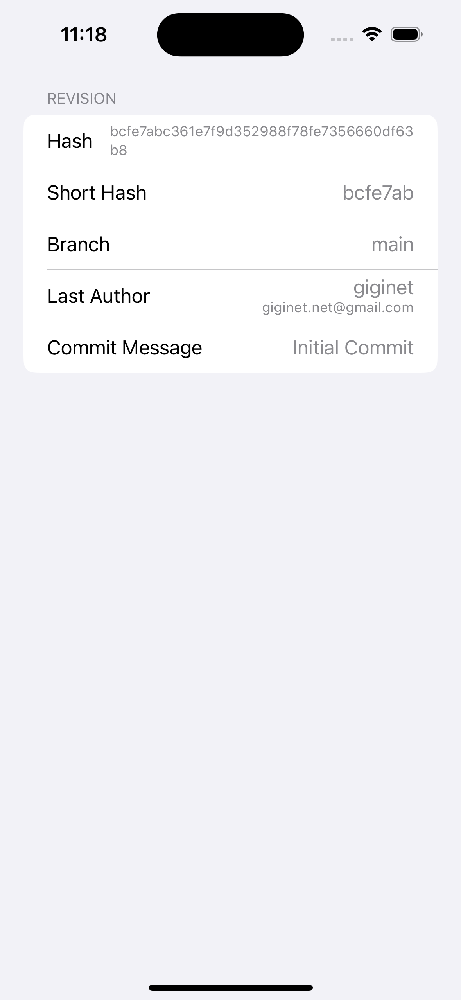
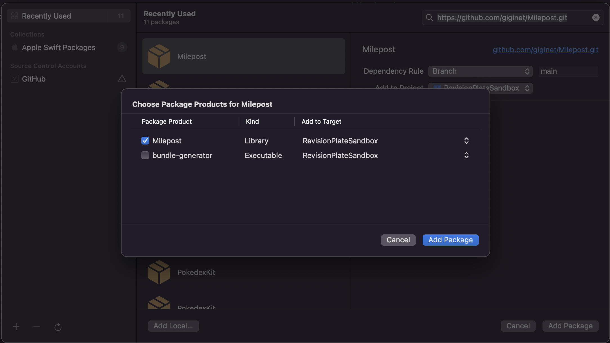
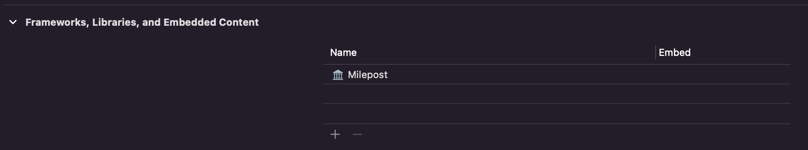
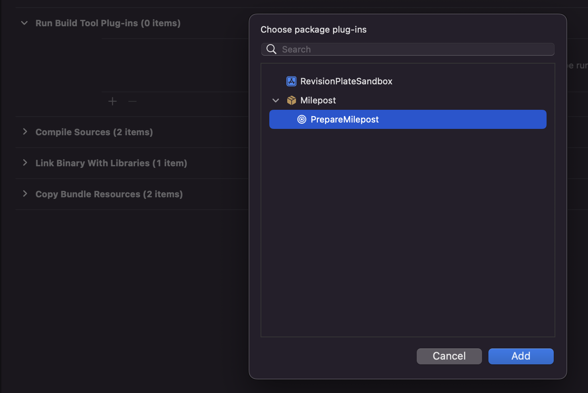

# Milepost

[](https://github.com/giginet/Milepost/actions?query=workflow%3AMilepost)
[](https://swift.org)
[](https://swift.org/package-manager/) 
[](https://github.com/giginet/Milepost/blob/main/Package.swift)
[](https://github.com/giginet/Milepost/blob/main/LICENSE.md)

A Simple SwiftPM plugin to show Git commit on your apps



## Summary

**Milepost** is a simple library to fetch Git commit info.

You can show Git revisions for debug builds or production builds for end-users' inquiry.

This library provides [SwiftPM Build Tools Plugin](https://github.com/apple/swift-evolution/blob/main/proposals/0303-swiftpm-extensible-build-tools.md). It helps developers to integrate it easily.

## Installation

### 1. Integrate Milepost in your project with SwiftPM

- File > Add Packages...
- Enter `https://github.com/giginet/Milepost.git`
- Choose `Milepost` product



### 2. Link Milepost in your application target 

- Application Target > `General` > `Frameworks, Libraries, and Embedded Content` > `+`
- Choose `Milepost`



### 3. Add build phases to fetch git info

- Application Target > `Build Phases` > `Run Build Tool Plug-ins` > `+`
- Choose `PrepareMilepost`
        



## Usage

You can fetch a latest revision with `RevisionLoader.load()`.

```swift
import Milepost

let revision = RevisionLoader.load()!
revision.hash
revision.branch
revision.shortHash
revision.lastCommit.author.description
revision.lastCommit.committer.description
revision.lastCommit.subject
revision.lastCommit.authorDate
revision.lastCommit.commitDate
```

You can easily build a setting page like followings:

```swift
import SwiftUI
import Milepost

struct RevisionView: View {
    var body: some View {
        List {
            Section {
                if let revision = RevisionLoader.load() {
                    LabeledContent("Hash") {
                        Text(revision.hash)
                            .font(.caption)
                    }
                    LabeledContent("Short Hash") {
                        Text(revision.shortHash)
                    }
                    LabeledContent("Branch") {
                        Text(revision.branch ?? "-")
                    }
                    LabeledContent("Last Author") {
                        VStack(alignment: .trailing) {
                            Text(revision.lastCommit.author.name)
                            Text(revision.lastCommit.author.email)
                                .font(.caption)
                        }
                    }
                    LabeledContent("Commit Message") {
                        Text(revision.lastCommit.subject ?? "-")
                    }
                }
            } header: {
                Text("Revision")
            }
        }
    }
}
```

## Requirements

|Users |Version|
|----------|----------|
|Developers|Xcode 14.0 or above and macOS 11.0 or above|
|App Users|any iOS, iPadOS, macOS, watchOS, tvOS|

This plugin uses SwiftPM Build Tools Plugin. So you have to use Xcode 14.0 or above.

This feature is only required on a build process. Thus, this library runs on any platform versions.
